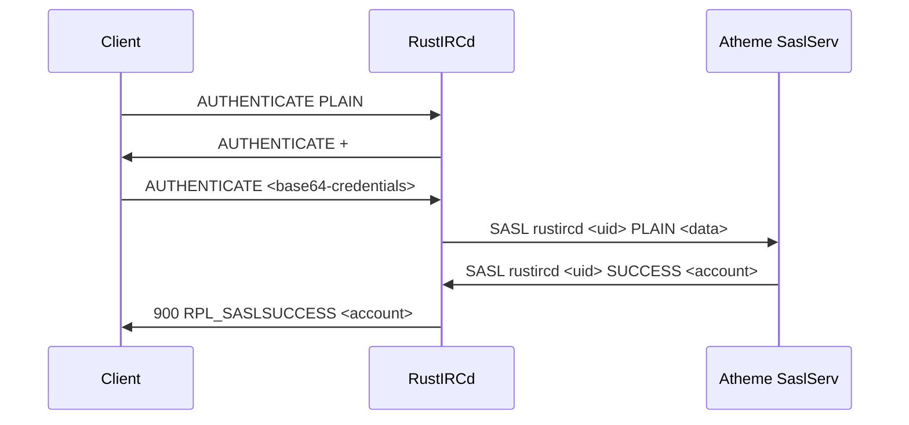

# Atheme SASL Integration Guide

## Overview

This guide explains how to integrate your RustIRCd with Atheme services for SASL authentication, following the same protocol used by [Solanum IRCd](https://github.com/solanum-ircd/solanum/tree/main) and other IRCv3-compliant servers.

## Architecture

The Atheme SASL integration uses **server-to-server (S2S) protocol commands** to communicate with Atheme's SaslServ for authentication, following the same approach as Solanum IRCd's `authd` module.

### Key Components

1. **AthemeIntegration**: Core Atheme services integration
2. **AthemeSaslAuthProvider**: Authentication provider that implements the AuthProvider trait
3. **SASL Message Handling**: Protocol handlers for SASL authentication flow
4. **Authentication Tracking**: Pending request management and timeout handling

## Protocol Flow

Based on the Solanum IRCd implementation, the SASL authentication flow works as follows:



## Setup Instructions

### 1. Configure Atheme Services

First, configure Atheme to enable SaslServ:

**atheme.conf:**
```conf
services {
    name = "services.example.org";
    uplink = "localhost";
    port = 6666;
    password = "atheme_password";
};

saslserv {
    name = "SaslServ";
    nick = "SaslServ";
    user = "services";
    host = "services.example.org";
    real = "Atheme SASL Service";
};
```

**Load SASL modules:**
```conf
module { name = "saslserv/main"; };
module { name = "saslserv/plain"; };
module { name = "saslserv/external"; };
```

### 2. Configure RustIRCd

**Create Atheme configuration:**
```rust
use rustircd_services::{AthemeConfig, AthemeServicesModule};

let atheme_config = AthemeConfig {
    enabled: true,
    service_name: "services.example.org".to_string(),
    hostname: "localhost".to_string(),
    port: 6666,
    password: "atheme_password".to_string(),
    tls: false,
    timeout_seconds: 30,
    reconnect_interval: 60,
    max_reconnect_attempts: 10,
};
```

### 3. Set up Authentication System

**Create authentication manager and register Atheme provider:**
```rust
use rustircd_core::{AuthManager};
use rustircd_services::{AthemeSaslAuthProvider};
use rustircd_modules::{SaslModule, SaslConfig};

// Create authentication manager
let auth_manager = Arc::new(AuthManager::new(3600));

// Create Atheme integration
let atheme_integration = Arc::new(AthemeIntegration::new(atheme_config));

// Create SASL authentication provider
let atheme_sasl_provider = Arc::new(AthemeSaslAuthProvider::new(atheme_integration));

// Register with authentication manager
auth_manager.register_provider(atheme_sasl_provider).await?;

// Set as primary provider
auth_manager.set_primary_provider("atheme_sasl").await?;

// Create SASL module
let sasl_config = SaslConfig {
    enabled: true,
    mechanisms: vec!["PLAIN".to_string(), "EXTERNAL".to_string()],
    service_name: "services.example.org".to_string(),
    require_sasl: false,
    timeout_seconds: 300,
};

let sasl_module = SaslModule::new(sasl_config, auth_manager);
```

## SASL Protocol Implementation

### Message Format

The SASL protocol uses the following message format for communication with Atheme:

**Authentication Request:**
```
SASL <server> <uid> <mechanism> <data>
```

**Authentication Response:**
```
SASL <server> <uid> <result> [data]
```

Where:
- `<server>`: Server name (e.g., "rustircd")
- `<uid>`: Unique client identifier
- `<mechanism>`: SASL mechanism (PLAIN, EXTERNAL, etc.)
- `<data>`: Base64-encoded authentication data
- `<result>`: SUCCESS, FAILURE, or CHALLENGE

### PLAIN Mechanism

For PLAIN mechanism, the authentication data is encoded as:
```
base64(authzid\0username\0password)
```

Example:
```rust
let auth_string = format!("{}\0{}\0{}", 
    authzid.unwrap_or(""),
    username,
    password
);
let data = general_purpose::STANDARD.encode(auth_string.as_bytes());
```

### EXTERNAL Mechanism

For EXTERNAL mechanism (certificate-based), the data field is typically empty as the authentication is based on the client certificate.

## Authentication Flow Implementation

### 1. Client Authentication Request

When a client initiates SASL authentication:

```rust
// Client sends: AUTHENTICATE PLAIN
// Server responds: AUTHENTICATE +
// Client sends: AUTHENTICATE <base64-credentials>

// SASL module decodes credentials and creates AuthRequest
let auth_request = AuthRequest {
    username: "alice".to_string(),
    credential: "password123".to_string(),
    authzid: None,
    client_info: ClientInfo {
        id: client_id,
        ip: client.ip.clone(),
        hostname: Some(client.host.clone()),
        secure: client.is_secure(),
    },
    context: HashMap::new(),
};
```

### 2. Send to Atheme

The authentication request is sent to Atheme:

```rust
let sasl_message = Message::with_prefix(
    Prefix::Server("services.example.org"),
    MessageType::Custom("SASL"),
    vec![
        "rustircd".to_string(),
        client_id.to_string(),
        "PLAIN".to_string(),
        base64_data,
    ]
);

atheme_integration.send_message(&sasl_message).await?;
```

### 3. Handle Atheme Response

Atheme responds with the authentication result:

```rust
// Atheme sends: SASL rustircd <uid> SUCCESS alice
match result {
    "SUCCESS" => {
        // Authentication successful
        let account_name = data.unwrap_or(&username);
        // Notify SASL module of success
    }
    "FAILURE" => {
        // Authentication failed
        let reason = data.unwrap_or("Authentication failed");
        // Notify SASL module of failure
    }
    "CHALLENGE" => {
        // Challenge-response authentication
        if let Some(challenge_data) = data {
            // Forward challenge to client
        }
    }
}
```

## Configuration Options

### Atheme Configuration

| Option | Description | Default |
|--------|-------------|---------|
| `enabled` | Whether Atheme integration is enabled | `true` |
| `service_name` | Atheme service name | `"services.example.org"` |
| `hostname` | Atheme server hostname | `"localhost"` |
| `port` | Atheme server port | `6666` |
| `password` | Connection password | `"password"` |
| `tls` | Whether to use TLS | `false` |
| `timeout_seconds` | Connection timeout | `30` |
| `reconnect_interval` | Reconnection interval | `60` |
| `max_reconnect_attempts` | Maximum reconnection attempts | `10` |

### SASL Configuration

| Option | Description | Default |
|--------|-------------|---------|
| `enabled` | Whether SASL is enabled | `true` |
| `mechanisms` | Supported SASL mechanisms | `["PLAIN", "EXTERNAL"]` |
| `service_name` | Service name for SASL | `"services.example.org"` |
| `require_sasl` | Whether SASL is required | `false` |
| `timeout_seconds` | SASL timeout | `300` |

## Monitoring and Statistics

### Atheme SASL Statistics

The integration tracks the following statistics:

```rust
struct AthemeSaslStats {
    successful: u64,        // Successful authentications
    failed: u64,           // Failed authentications
    timeouts: u64,         // Timeout errors
    protocol_errors: u64,  // Protocol errors
    pending_requests: u64, // Currently pending requests
}
```

### Accessing Statistics

```rust
let stats = atheme_integration.get_sasl_stats().await;
println!("Successful SASL authentications: {}", stats.successful);
println!("Failed SASL authentications: {}", stats.failed);
println!("Pending requests: {}", stats.pending_requests);
```

## Troubleshooting

### Common Issues

1. **Atheme Connection Failed**
   - Check Atheme server is running
   - Verify hostname and port configuration
   - Check password matches Atheme configuration

2. **SASL Authentication Failures**
   - Verify SaslServ is loaded in Atheme
   - Check user exists in Atheme database
   - Verify SASL mechanisms are supported

3. **Timeout Errors**
   - Check network connectivity
   - Increase timeout values if needed
   - Monitor Atheme server performance

### Debug Logging

Enable debug logging to trace authentication flows:

```rust
tracing_subscriber::fmt()
    .with_max_level(tracing::Level::DEBUG)
    .init();
```

### Health Checks

```rust
// Check if Atheme is connected
if atheme_integration.is_connected().await {
    println!("Atheme connection: OK");
} else {
    println!("Atheme connection: FAILED");
}

// Check authentication provider availability
if atheme_sasl_provider.is_available().await {
    println!("Atheme SASL provider: Available");
} else {
    println!("Atheme SASL provider: Unavailable");
}
```

## Security Considerations

### Connection Security

- Use TLS connections between RustIRCd and Atheme
- Secure the connection password
- Restrict network access to Atheme server

### Authentication Security

- SASL credentials are base64-encoded but not encrypted
- Use TLS for client connections when possible
- Consider using EXTERNAL mechanism for certificate-based auth

### Account Management

- Atheme handles account creation and management
- Account names are validated against Atheme database
- Failed authentication attempts are logged

## Integration with Other Systems

### Fallback Authentication

You can set up multiple authentication providers with Atheme as primary:

```rust
// Set Atheme as primary
auth_manager.set_primary_provider("atheme_sasl").await?;

// Add fallback providers
auth_manager.add_fallback_provider("ldap").await?;
auth_manager.add_fallback_provider("database").await?;
```

### Services Integration

The Atheme integration also handles:
- User registration notifications
- Channel creation notifications
- Account change notifications
- NickServ operations

## Performance Optimization

### Connection Pooling

- Atheme integration maintains persistent connections
- Automatic reconnection on connection loss
- Connection health monitoring

### Request Caching

- Authentication results are cached by the AuthManager
- Configurable cache TTL (default: 1 hour)
- Automatic cleanup of expired entries

### Timeout Management

- Configurable timeouts for all operations
- Graceful handling of timeout scenarios
- Automatic cleanup of expired requests

## Migration from Other Systems

### From Basic SASL

1. Replace basic SASL authentication with Atheme integration
2. Configure Atheme services
3. Update SASL module to use AuthManager
4. Test authentication flow

### From Other IRC Daemons

1. Export user database from existing system
2. Import users into Atheme
3. Configure Atheme to match existing setup
4. Update client configurations if needed

## Example Configuration

See `examples/atheme_sasl_integration_example.rs` for a complete working example of Atheme SASL integration.
