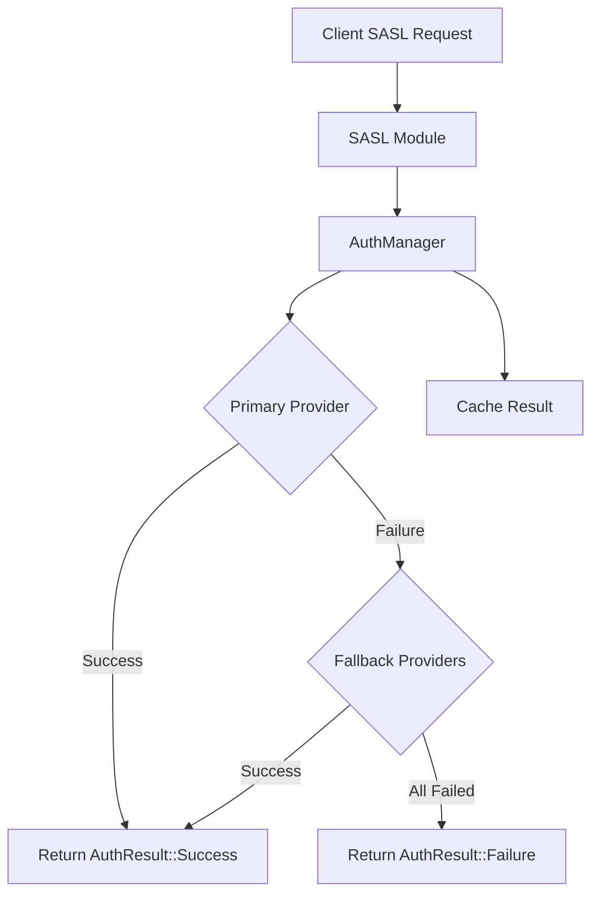

# Authentication System Documentation

## Overview

The RustIRCd authentication system provides a flexible, extensible framework for user authentication that integrates seamlessly with SASL (Simple Authentication and Security Layer) and IRC services. The system supports multiple authentication providers, including services integration (Atheme, Charybdis) and external authentication systems (LDAP, database, file-based, HTTP).

## Architecture

### Core Components

1. **AuthManager**: Central authentication coordinator that manages multiple providers
2. **AuthProvider Trait**: Interface for authentication providers
3. **Services Integration**: Hooks for IRC services authentication
4. **External Providers**: LDAP, database, file, and HTTP authentication modules

### Key Features

- **Multi-Provider Support**: Register multiple authentication providers with fallback support
- **Services Integration**: Seamless integration with Atheme and other IRC services
- **Caching**: Built-in authentication result caching for performance
- **Flexible Configuration**: Support for various authentication methods and formats
- **SASL Integration**: Full SASL support with customizable mechanisms

## Authentication Flow



## Usage Examples

### Basic Setup

```rust
use rustircd_core::{AuthManager, AuthProvider};
use rustircd_modules::{SaslModule, SaslConfig, LdapAuthProvider};

// Create authentication manager
let auth_manager = Arc::new(AuthManager::new(3600)); // 1 hour cache

// Register LDAP provider
let ldap_config = LdapConfig {
    hostname: "ldap.example.com".to_string(),
    port: 389,
    base_dn: "dc=example,dc=com".to_string(),
    // ... other config
};
let ldap_provider = Arc::new(LdapAuthProvider::new(ldap_config));
auth_manager.register_provider(ldap_provider).await?;

// Set as primary provider
auth_manager.set_primary_provider("ldap").await?;

// Create SASL module with authentication manager
let sasl_config = SaslConfig {
    enabled: true,
    mechanisms: vec!["PLAIN".to_string()],
    // ... other config
};
let sasl_module = SaslModule::new(sasl_config, auth_manager);
```

### Services Integration

```rust
use rustircd_services::{ServicesAuthManager, AthemeServicesModule};

// Create services authentication manager
let services_auth_manager = ServicesAuthManager::new(
    auth_manager.clone(),
    service_context,
);

// Register Atheme provider
services_auth_manager.register_atheme_provider(Some(attheme_service)).await?;

// Register generic services provider
services_auth_manager.register_services_provider("charybdis".to_string()).await?;
```

### Authentication Request

```rust
use rustircd_core::{AuthRequest, ClientInfo};

let auth_request = AuthRequest {
    username: "alice".to_string(),
    credential: "password123".to_string(),
    authzid: None,
    client_info: ClientInfo {
        id: client.id,
        ip: "192.168.1.100".to_string(),
        hostname: Some("client.example.com".to_string()),
        secure: true,
    },
    context: HashMap::new(),
};

match auth_manager.authenticate(&auth_request).await? {
    AuthResult::Success(auth_info) => {
        println!("Authentication successful: {}", auth_info.username);
    }
    AuthResult::Failure(reason) => {
        println!("Authentication failed: {}", reason);
    }
    // Handle other cases...
}
```

## Authentication Providers

### 1. Services Provider (`ServicesAuthProvider`)

Integrates with IRC services like Atheme and Charybdis.

**Features:**
- Account validation against services backend
- Support for NickServ authentication
- Automatic service connection management

**Configuration:**
```rust
let services_provider = ServicesAuthProvider::new(
    service_context,
    "atheme".to_string(),
);
```

### 2. LDAP Provider (`LdapAuthProvider`)

Authenticates against LDAP directories.

**Features:**
- Support for various LDAP servers
- Configurable search filters
- Connection pooling
- TLS support

**Configuration:**
```rust
let ldap_config = LdapConfig {
    hostname: "ldap.example.com".to_string(),
    port: 389,
    base_dn: "dc=example,dc=com".to_string(),
    bind_dn: Some("cn=admin,dc=example,dc=com".to_string()),
    bind_password: Some("admin_password".to_string()),
    user_filter: "(uid={username})".to_string(),
    use_tls: false,
    timeout_seconds: 30,
    max_connections: 10,
};
```

### 3. Database Provider (`DatabaseAuthProvider`)

Authenticates against database tables.

**Features:**
- Support for various database systems
- Configurable table and column names
- Multiple password hash algorithms
- Metadata extraction

**Configuration:**
```rust
let db_config = DatabaseAuthConfig {
    connection_string: "sqlite://users.db".to_string(),
    users_table: "users".to_string(),
    username_column: "username".to_string(),
    password_column: "password".to_string(),
    realname_column: Some("realname".to_string()),
    password_hash: PasswordHashType::Sha256,
    // ... other config
};
```

### 4. File Provider (`FileAuthProvider`)

Authenticates against file-based user databases.

**Features:**
- Multiple file formats (plain, CSV, JSON, YAML, passwd)
- Auto-reload on file changes
- Configurable password hashing
- Caching support

**Configuration:**
```rust
let file_config = FileAuthConfig {
    user_file: PathBuf::from("users.txt"),
    format: FileFormat::Plain,
    password_hash: PasswordHashType::Sha256,
    cache_ttl: 300,
    auto_reload: true,
};
```

### 5. HTTP Provider (`HttpAuthProvider`)

Authenticates against HTTP-based authentication services.

**Features:**
- RESTful API integration
- Configurable HTTP methods
- Multiple response formats
- Validation endpoint support

**Configuration:**
```rust
let http_config = HttpAuthConfig {
    base_url: "https://auth.example.com".to_string(),
    auth_endpoint: "/authenticate".to_string(),
    validation_endpoint: Some("/validate".to_string()),
    method: HttpMethod::Post,
    headers: headers_map,
    timeout_seconds: 30,
    verify_tls: true,
    username_field: "username".to_string(),
    password_field: "password".to_string(),
    response_format: ResponseFormat::Json,
};
```

## SASL Integration

The SASL module has been enhanced to use the authentication system:

### Supported Mechanisms

- **PLAIN**: Username/password authentication
- **EXTERNAL**: Certificate-based authentication

### Configuration

```rust
let sasl_config = SaslConfig {
    enabled: true,
    mechanisms: vec!["PLAIN".to_string(), "EXTERNAL".to_string()],
    service_name: "services.example.org".to_string(),
    require_sasl: false,
    timeout_seconds: 300,
};

let sasl_module = SaslModule::new(sasl_config, auth_manager);
```

### Authentication Flow

1. Client sends `AUTHENTICATE PLAIN <base64-data>`
2. SASL module decodes credentials
3. Creates `AuthRequest` with client information
4. Calls `AuthManager::authenticate()`
5. AuthManager tries providers in order (primary → fallbacks)
6. Returns appropriate `AuthResult`
7. SASL module responds with success/failure/challenge

## Configuration Examples

### Multi-Provider Setup

```rust
// Primary: LDAP
auth_manager.set_primary_provider("ldap").await?;

// Fallbacks: Database, File, Services
auth_manager.add_fallback_provider("database").await?;
auth_manager.add_fallback_provider("file").await?;
auth_manager.add_fallback_provider("atheme").await?;
```

### Services-Only Setup

```rust
// Only use Atheme services
auth_manager.set_primary_provider("atheme").await?;
// No fallbacks needed
```

### File-Based Setup

```rust
// Simple file-based authentication
auth_manager.set_primary_provider("file").await?;
auth_manager.add_fallback_provider("database").await?;
```

## Performance Considerations

### Caching

- Authentication results are cached by default (1 hour TTL)
- Cache can be configured per AuthManager instance
- Automatic cleanup of expired entries

### Connection Pooling

- LDAP and database providers support connection pooling
- HTTP provider reuses HTTP client connections
- Services providers manage service connections

### Timeouts

- Configurable timeouts for all providers
- Graceful fallback on timeout
- Circuit breaker pattern for failing providers

## Security Considerations

### Password Security

- Support for secure password hashing (bcrypt, Argon2)
- No plain text password storage in memory
- Credentials are cleared after authentication

### Network Security

- TLS support for LDAP and HTTP providers
- Certificate validation options
- Secure connection requirements

### Access Control

- Provider-specific access controls
- Client IP and hostname validation
- Account status checking

## Monitoring and Statistics

### Provider Statistics

Each provider tracks:
- Successful authentications
- Failed authentications
- Connection errors
- Response times

### Authentication Manager Statistics

- Cache hit/miss ratios
- Provider usage statistics
- Authentication success rates

## Troubleshooting

### Common Issues

1. **Provider Not Available**: Check provider configuration and connectivity
2. **Authentication Failures**: Verify credentials and provider configuration
3. **Cache Issues**: Check cache TTL and cleanup processes
4. **Services Integration**: Ensure services are running and accessible

### Debug Logging

Enable debug logging to trace authentication flows:

```rust
tracing_subscriber::fmt()
    .with_max_level(tracing::Level::DEBUG)
    .init();
```

### Health Checks

```rust
// Check provider availability
for provider_name in auth_manager.get_providers().await {
    let capabilities = auth_manager.get_provider_capabilities(&provider_name).await;
    println!("Provider {}: {:?}", provider_name, capabilities);
}
```

## Migration Guide

### From Basic SASL

1. Create `AuthManager` instance
2. Register authentication providers
3. Update `SaslModule` constructor to include `AuthManager`
4. Configure primary and fallback providers

### From Services-Only

1. Keep existing services configuration
2. Add `AuthManager` and register services provider
3. Optionally add external providers as fallbacks
4. Update SASL module to use new authentication system

## Future Enhancements

- OAuth2/OIDC provider support
- Multi-factor authentication
- Rate limiting and brute force protection
- Advanced caching strategies
- Metrics and monitoring integration
- Configuration hot-reloading
